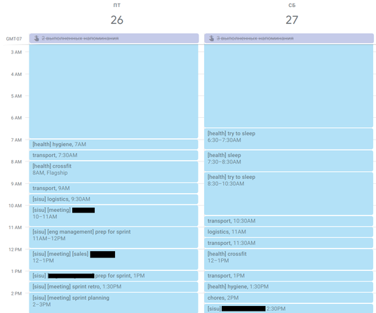

# timefly

This module, `timefly`, helps you keep track of where you're spending your time.
It's pretty specific to how I've set up my calendar. You'll likely not get much use
out of this unless you use your calendar the same way.

For *literally* every hour of your day, record what you're doing and tag it appropriately.

These scripts only look at the `summary` field, which is specified by the "Event Title" field
in the calendar application. If you tag your events with square bracket tags, then this package
can do a little bit of analysis for you.

For instance, you might create an event called `[health] sleep` from 11PM to 7AM, followed by
`[transportation] go to work` from 7AM to 8AM, and then another one called
`[work] [do some coding] new feature push` from 8AM to 5PM. This can handle multiple tags
and tags with spaces in them. Just don't do dumb shit like `[ [] i ] do Q][A`.

See the [Example section](#example) below.

## Setup

Only tested on linux. To install the enviornment:

```
conda env create -f environment.yaml
```

To activate the environment:

```
conda activate timefly-env
```

To update deps:

```
conda env export > environment.yaml
```


## Scripts

All scripts are available in `scripts/`, and should be run from the repo root in the `timefly-env`.

| script | purpose |
| ------ | ------- |
| `format.sh` | auto-format the entire `timefly` directory |

## Example

All mainfiles are documented. Run `python -m timefly.main.* --help` for any `*` for details.

```{bash}
# load all data from gcal from given date (default --end is now)
# stores to ./data/new.pkl by default
python -m timefly.main.ingest --begin 2018-12-01

# merge new data from ./data/new.pkl into ./data/running.pkl
python -m timefly.main.merge

# overview of my first half of May
# use timefly.main.drill for an interactive version
python -m timefly.main.digest --begin 2019-05-01 --min_support 0.01 --end 2019-05-15

> events in range 2019-05-01 12:00AM PDT - 2019-05-16 12:00AM PDT
>   7.5 hours of 360.0 uncovered ( 2.1% total)
> found 124 tags in range
> 40.8% health
>   68.9% sleep
>   22.0% try to sleep
>   4.7%  crossfit
>   3.0%  hygiene
>   1.4%  other
> 25.1% [work]
>   42.9% datasci
>   14.8% meeting
>   8.8% code review
>   7.7%  answer questions
>   6.6%  recruiting
>   19.2% other
> 9.6%  research
> 4.5%  [redacted]
> 4.1%  fun
>   36.7% tv
>   63.3% other
> 3.6%  food
>   46.2% dinner
>   38.5% lunch
>   15.4% other
> 3.2%  transport
> 1.7%  reading
> 7.4%  other

# week-to-week changes (current vs previous week by default, window size adjustable)
python -m timefly.main.versus
> 94 events in range 2019-05-13 07:58PM PDT - 2019-05-20 07:58PM PDT
> 130 events in range 2019-05-20 07:58PM PDT - 2019-05-27 07:58PM PDT
>  13.0 hours of 336.0 uncovered ( 3.9% total)
> from prev to next, units are hours
> -23.9% travel from 40.0 to  0.0
>  +7.9% reading from  1.0 to 13.5
>  +7.2% health from 60.0 to 68.0
>  +4.5% sisu from 29.0 to 34.5
>  +2.7% transport from  4.5 to  8.5
>  +1.3% chores from  0.0 to  2.0
>  +1.3% meeting from  0.0 to  2.0
>  -0.9% other changes
```

Here's an excerpt from my calendar. You can see me trying to sleep in on Saturday:



# TODO

* move `rank_by_popular_tag` from `versus.py` into `tags.py`, reuse in `drill` and `digest`.
